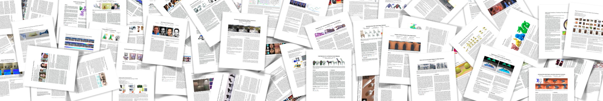

# replicability.graphics

[](https://archive.softwareheritage.org/swh:1:dir:b530de7decc22e7ad7cf46fe650ae1919b4bf60b/)

Companion website  and data of the [article](replicability.pdf):

     Code Replicability in Computer Graphics, Nicolas Bonneel, David
     Coeurjolly, Julie Digne, Nicolas Mellado, ACM Transactions on
     Graphics (Proceeding of SIGGRAPH 2020, 39:4)

* Nicolas Bonneel (CNRS, LIRIS, Lyon, France)
* David Coeurjolly (CNRS, LIRIS, Lyon, France)
* Julie Digne (CNRS, LIRIS, Lyon, France)
* Nicolas Mellado (CNRS, IRIT, Toulouse, France)

More details: [https://replicability.graphics](https://replicability.graphics)

## Citing

``` bibtex
@article{replicGraph2020,
  author  =    {Nicolas Bonneel, David Coeurjolly, Julie Digne and Nicolas Mellado},
  title   =    {Code replicabiltiy in computer graphics},
  journal =    {ACM Transactions on Graphics (Proceedings of SIGGRAPH 2020)},
  year    =    {2020},
  volume  =    {39},
  number  =    {4},
}
```

## Contributors

* [Contributors list](CONTRIBUTORS.md)



